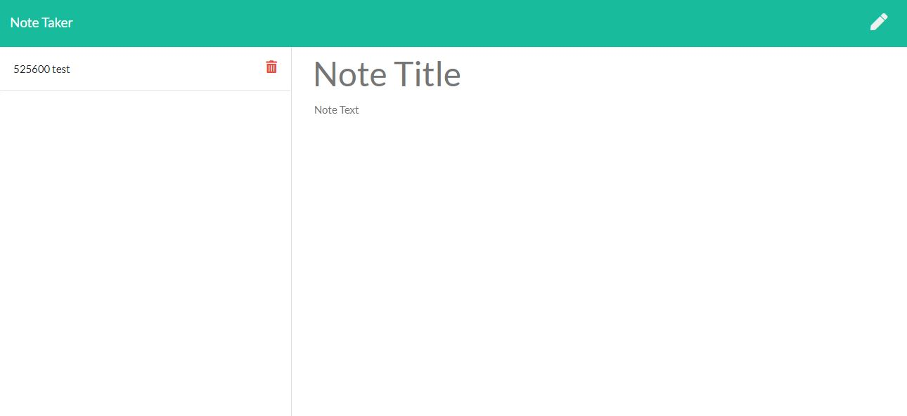

# NoteTaker
  
  ## Description 
      This javascript function allows a user to save and delete notes.
## Table of Contents
1.[Usage](#Usage)
2.[Contribution](#Contribution)
3.[Questions](#Questions)

## Usage
    This can be used for saving notes between users. For users that need to keep track of a lot of information, it's easy to forget or be unable to recall something important. Being able to take persistent notes allows users to have written information available when needed. 
## Installation Requirements
    This application requires npm packages express.            
## Contribution 
    Please contact Ben de Garcia to assist with future iterations.
## Questions
  
If you have questions, contact me at [GitHub](https://github.com/bdegarcia).